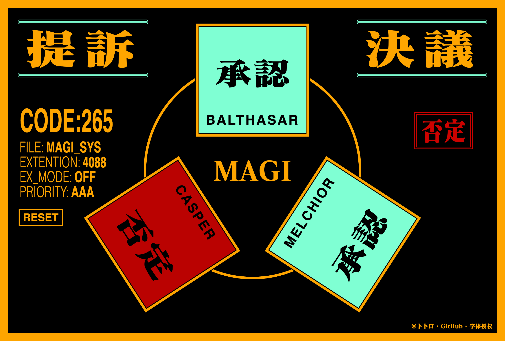

# 👩🏼「MAGI System」 一键决议系统

通过 `MELCHIOR`、`BALTHASAR`、`CASPER` 三大模块，虚拟人类所具有的多重身份思考模式，对案件进行智能决议。

## 地址
https://lab.magiconch.com/magi/

## 如何使用
点击鼠标 或者 敲击空格 即可开启决议

## 功能
- [x] 基础决议
- [x] EX MODE
- [x] 概率调整
- [x] 优先级
- [x] 提示音效

## 微博
https://weibo.com/1197780522/LwOVxaMdO

## 字体授权
https://fontworks.co.jp/products/evamatisse/